# Concur EKS Platform - Proof of Concept

**Author:** Jian Ouyang (jian.ouyang@sapns2.com)
**Purpose:** EKS platform demonstration for Concur team

---

## Table of Contents

1. [Executive Summary](#executive-summary)
2. [Architecture Overview](#architecture-overview)
3. [Infrastructure Components](#infrastructure-components)
4. [GitOps with ArgoCD](#gitops-with-argocd)
5. [Observability Stack](#observability-stack)
6. [Sample Applications](#sample-applications)
7. [Access Guide](#access-guide)
8. [Demo Scenarios](#demo-scenarios)
9. [Technical Deep Dive](#technical-deep-dive)

---

## Executive Summary

This POC demonstrates a production-ready Amazon EKS platform with comprehensive DevOps capabilities:

**✅ Key Achievements:**
- Multi-AZ EKS cluster (Kubernetes 1.34) with 4 nodes
- GitOps-driven deployment using ArgoCD
- **Service Mesh:** Linkerd with automatic mTLS encryption and advanced observability
- Complete observability: Logging (Fluent Bit → CloudWatch), Metrics (Prometheus + Grafana)
- Auto-scaling: Cluster Autoscaler for node management
- Security: IRSA, encrypted storage (KMS), AWS Secrets Manager integration, zero-trust mTLS
- Production patterns: Sample apps with ALB ingress, PostgreSQL, Redis

**📊 Platform Metrics:**
- **Cluster:** `concur-test-eks` (us-east-1)
- **Nodes:** 4 t3.medium instances (auto-scaled from 3)
- **Applications:** 10 ArgoCD apps deployed (including Linkerd)
- **Service Mesh:** All app pods meshed with automatic mTLS
- **Logging:** ~1000 logs/min to CloudWatch
- **Monitoring:** 30-day retention, encrypted gp3 storage

---

## Architecture Overview

### High-Level Architecture

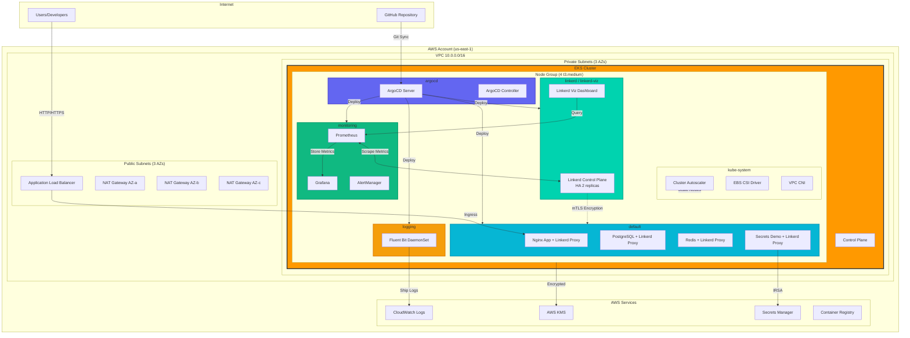

### Network Architecture

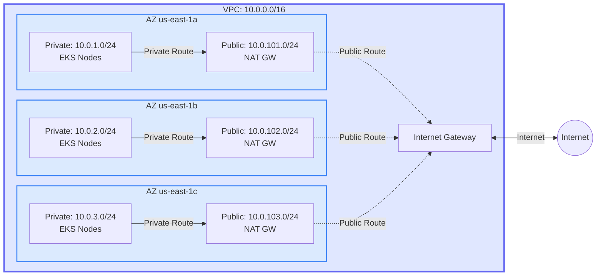

---

## Infrastructure Components

### 1. EKS Cluster Configuration

| Component | Configuration | Details |
|-----------|--------------|---------|
| **Cluster Name** | `concur-test-eks` |  |
| **Kubernetes Version** | 1.34 | Latest version (1.34) |
| **Region** | us-east-1 | 3 AZs for HA |
| **Control Plane** | Managed by AWS | Private subnets only |
| **Endpoints** | Public + Private | Secure access |
| **Authentication** | API_AND_CONFIG_MAP | Supports legacy + new access |
| **Logging** | All types enabled | api, audit, authenticator, controllerManager, scheduler |

### 2. EKS Managed Add-ons

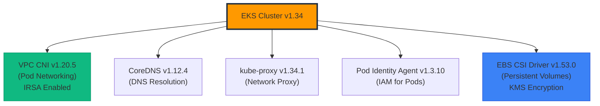

**VPC CNI with IRSA:**
- Uses dedicated IAM role (not node role)
- Better security and auditability
- Pod-level network management

**EBS CSI Driver:**
- KMS encryption at rest
- Dynamic volume provisioning
- gp3 storage class (better performance/cost)

### 3. Node Group

| Setting | Value | Rationale |
|---------|-------|-----------|
| **Instance Type** | t3.medium | Cost-effective for demo |
| **Min Size** | 2 | Basic HA |
| **Max Size** | 6 | Allow for growth |
| **Desired Size** | 4 | Current load (auto-scaled) |
| **AMI** | AL2023_x86_64_STANDARD | Latest Amazon Linux |
| **Disk** | 20GB gp3 encrypted | Default optimized |

**Auto-Scaling Tags:**
```hcl
"k8s.io/cluster-autoscaler/enabled" = "true"
"k8s.io/cluster-autoscaler/concur-test-eks" = "owned"
```

### 4. IRSA (IAM Roles for Service Accounts)

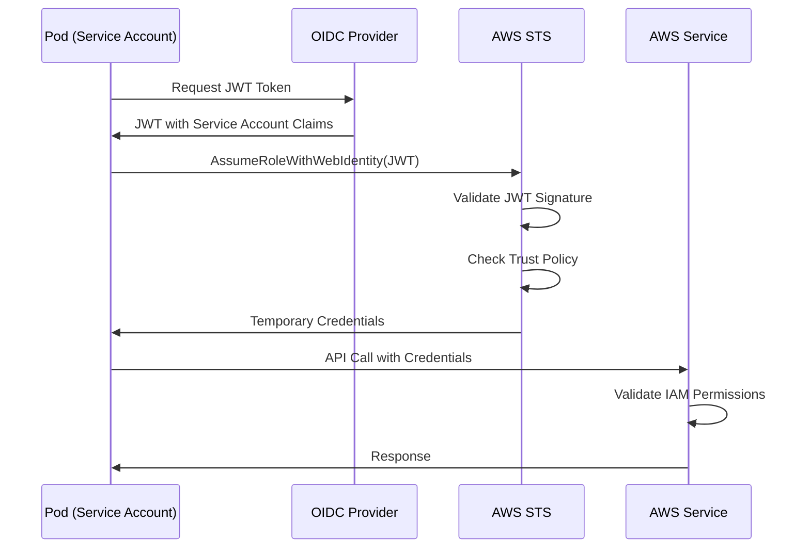

**IRSA Roles in Cluster:**
1. **VPC CNI Role** - Network management
2. **EBS CSI Driver Role** - Volume operations + KMS
3. **Cluster Autoscaler Role** - ASG management
4. **AWS LB Controller Role** - ALB/NLB provisioning
5. **Fluent Bit Role** - CloudWatch Logs
6. **Secrets Reader Role** - Secrets Manager access

---

### 5. Linkerd Service Mesh

**Purpose:** Zero-trust security and advanced observability for service-to-service communication

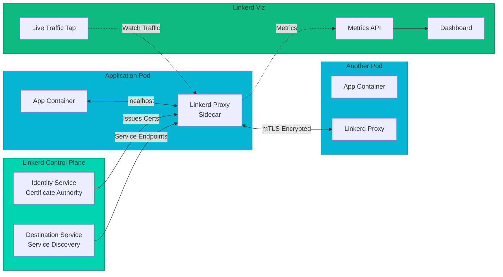

**Key Features:**

| Feature | Description | Benefit |
|---------|-------------|---------|
| **Automatic mTLS** | Transparent encryption for all pod-to-pod traffic | Zero-trust security without code changes |
| **Certificate Management** | Automatic cert issuance and rotation (24h lifetime) | No manual certificate management |
| **Golden Metrics** | Success rate, RPS, latency (p50, p95, p99) | Deep observability without instrumentation |
| **Live Traffic Tap** | Real-time request/response inspection | Debug production issues instantly |
| **Service Topology** | Visualize service dependencies | Understand system architecture |
| **Traffic Management** | Circuit breaking, retries, timeouts | Improved reliability |
| **High Availability** | 2-replica control plane | Production-ready deployment |

**Architecture Components:**

```yaml
# Linkerd Namespaces
linkerd/                    # Control plane
  - linkerd-identity        # Certificate authority (2 replicas)
  - linkerd-destination     # Service discovery (2 replicas)
  - linkerd-proxy-injector  # Automatic sidecar injection (2 replicas)

linkerd-viz/               # Observability
  - web                    # Dashboard UI
  - metrics-api            # Metrics aggregation
  - tap                    # Live traffic inspection
  - tap-injector           # Tap enablement

# Application Pods (with linkerd-proxy sidecar)
nginx-alb/                 # 3/3 pods meshed
postgres/                  # 1/1 pods meshed
redis/                     # 1/1 pods meshed
secrets-demo/              # 1/1 pods meshed
```

**Resource Overhead:**
- **Control Plane:** ~800m CPU, ~512Mi memory (6 pods)
- **Viz Dashboard:** ~400m CPU, ~256Mi memory (4 pods)
- **Per-Pod Sidecar:** ~100m CPU, ~64Mi memory
- **Latency Overhead:** p50 < 1ms, p99 < 5ms

**Certificate Hierarchy:**
```
Trust Anchor CA (10-year validity)
  └── Identity Issuer Certificate (1-year validity)
       └── Pod Certificates (24-hour validity, auto-rotated)
            └── mTLS between services
```

**Verification:**
```bash
# Check Linkerd health
linkerd check

# View mesh status
linkerd viz stat deploy --all-namespaces

# Verify mTLS (look for tls=true)
linkerd viz tap deploy/nginx -n nginx-alb

# Access dashboard
kubectl port-forward -n linkerd-viz svc/web 8084:8084
# Open: http://localhost:8084
```

**Documentation:** See `LINKERD-DEPLOYMENT.md` for complete deployment guide, troubleshooting, and demo scenarios.

---

## GitOps with ArgoCD

### ArgoCD Architecture

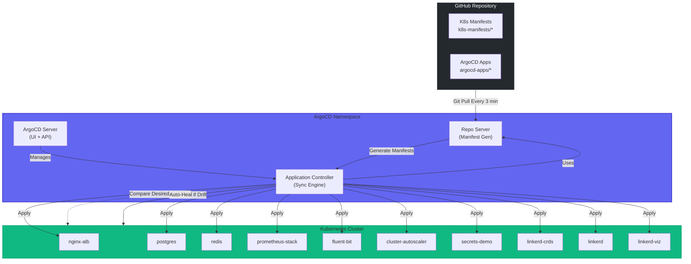

### How ArgoCD Works

#### 1. Repository Structure

```
eks/
├── argocd-apps/                    # ArgoCD Application CRDs
│   ├── cluster-autoscaler-app.yaml
│   ├── fluent-bit-app.yaml
│   ├── linkerd-crds-app.yaml
│   ├── linkerd-app.yaml
│   ├── linkerd-viz-app.yaml
│   ├── nginx-app.yaml
│   ├── postgres-app.yaml
│   ├── prometheus-stack-app.yaml
│   ├── redis-app.yaml
│   └── secrets-demo-app.yaml
│
└── k8s-manifests/                  # Kubernetes manifests
    ├── cluster-autoscaler/         # Target: kube-system
    ├── fluent-bit/                 # Target: logging
    ├── linkerd/                    # Target: linkerd, linkerd-viz (Helm)
    ├── monitoring/                 # Target: monitoring (Helm)
    ├── nginx-alb/                  # Target: default
    ├── postgres/                   # Target: default
    ├── redis/                      # Target: default
    └── secrets-demo/               # Target: default
```

#### 2. Sync Modes

**Automated Sync (Enabled for all apps):**
```yaml
spec:
  syncPolicy:
    automated:
      prune: true        # Delete resources not in Git
      selfHeal: true     # Auto-fix manual changes
```

**How Auto-Sync Works:**
1. **Detection:** ArgoCD polls Git every 3 minutes
2. **Comparison:** Compares Git state vs cluster state
3. **Sync:** Applies differences automatically
4. **Prune:** Removes resources not in Git
5. **Self-Heal:** Reverts manual kubectl changes

**Manual Sync:**
```bash
# Trigger manual sync
argocd app sync nginx-alb

# Sync all apps
argocd app sync --all
```

#### 3. Current Applications

| Application | Namespace | Status | Sync Policy | Health |
|-------------|-----------|--------|-------------|--------|
| cluster-autoscaler | kube-system | Synced | Auto | Healthy |
| fluent-bit | logging | Synced | Auto | Healthy |
| linkerd-crds | linkerd | Synced | Auto | Healthy |
| linkerd | linkerd | Synced | Auto | Healthy |
| linkerd-viz | linkerd-viz | Synced | Auto | Healthy |
| nginx-alb | nginx-alb | Synced | Auto | Healthy |
| postgres | postgres | Synced | Auto | Healthy |
| prometheus-stack | monitoring | Synced | Auto | Healthy |
| redis | redis | Synced | Auto | Healthy |
| secrets-demo | secrets-demo | Synced | Auto | Healthy |

#### 4. Deployment Flow

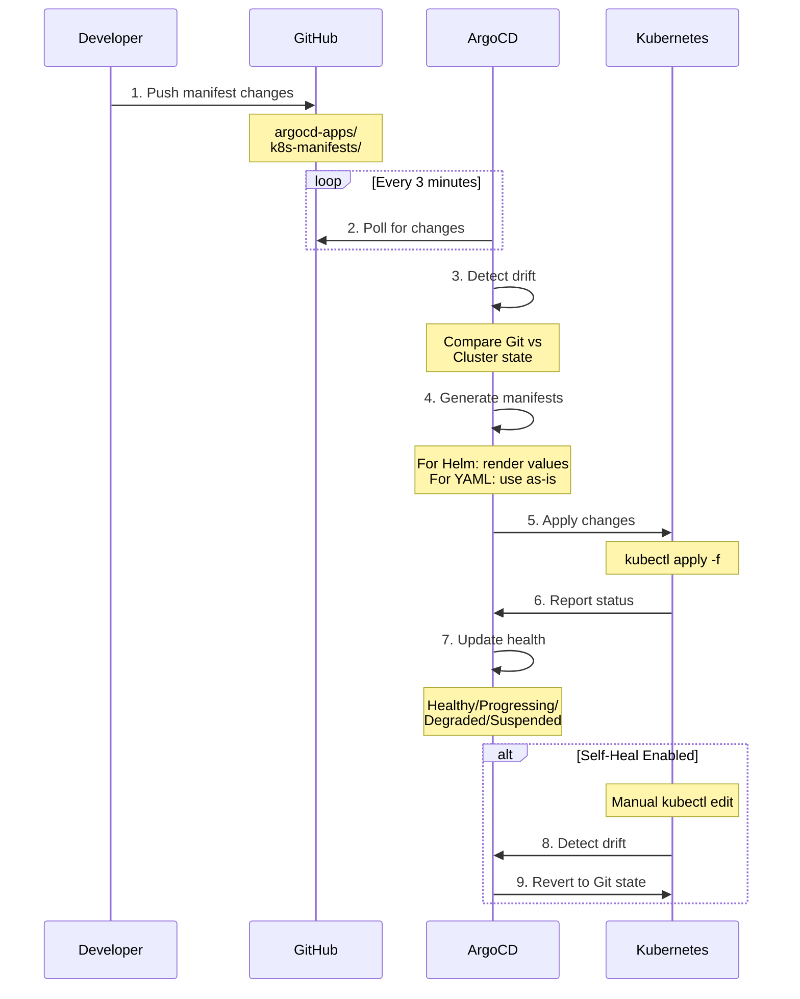

### Demo: GitOps in Action

**Scenario 1: Update Nginx Replicas**

```bash
# 1. Edit manifest in Git
vim k8s-manifests/nginx-alb/deployment.yaml
# Change replicas: 2 -> 3

# 2. Commit and push
git add k8s-manifests/nginx-alb/deployment.yaml
git commit -m "Scale nginx to 3 replicas"
git push origin main

# 3. ArgoCD detects and syncs (within 3 min)
# Watch the sync:
kubectl get pods -l app=nginx -w

# 4. Verify in ArgoCD UI
# Status: Synced, Health: Healthy
```

**Scenario 2: Self-Heal Demonstration**

```bash
# 1. Manually scale deployment
kubectl scale deployment nginx --replicas=5

# 2. ArgoCD detects drift (within 3 min)
argocd app get nginx-alb
# Status: OutOfSync

# 3. ArgoCD auto-heals
# Reverts replicas back to Git state (3)

# 4. Verify
kubectl get deployment nginx
# Shows 3 replicas (Git source of truth)
```

---

## Observability Stack

### Logging Architecture (Fluent Bit → CloudWatch)

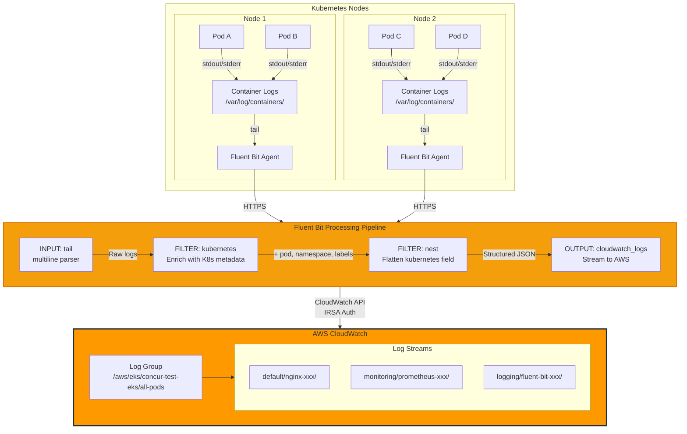

#### Fluent Bit Configuration

**Key Features:**
- **DaemonSet:** One pod per node (currently 3/4 running)
- **Multiline Parsing:** Handles multi-line stack traces
- **Kubernetes Enrichment:** Adds pod, namespace, labels, annotations
- **Auto-Retry:** Buffered uploads with backoff
- **IRSA:** No static credentials needed

**Log Processing Pipeline:**
```yaml
[INPUT]
  Name                tail
  Path                /var/log/containers/*.log
  multiline.parser    docker, cri
  Tag                 kube.*
  DB                  /var/fluent-bit/state/flb_kube.db  # Track processed files

[FILTER]
  Name                kubernetes
  Match               kube.*
  Kube_URL            https://kubernetes.default.svc:443
  Merge_Log           On      # Parse JSON logs
  Keep_Log            On      # Keep original log field
  K8S-Logging.Parser  On      # Parse log field
  Labels              On      # Include pod labels
  Annotations         Off     # Exclude annotations (reduce size)

[FILTER]
  Name                nest
  Match               kube.*
  Operation           lift
  Nested_under        kubernetes
  Add_prefix          k8s_    # Flatten: kubernetes.pod_name -> k8s_pod_name

[OUTPUT]
  Name                cloudwatch_logs
  Match               kube.*
  region              us-east-1
  log_group_name      /aws/eks/concur-test-eks/all-pods
  log_stream_prefix   ${k8s_namespace_name}/${k8s_pod_name}/
  auto_create_group   true
  log_retention_days  7
```

**CloudWatch Log Structure:**
```
/aws/eks/concur-test-eks/all-pods
├── default/nginx-7d8f9b6c-4x8vz/
│   └── 2025/xx/xx/[$LATEST]... (JSON logs)
├── monitoring/prometheus-stack-kube-prom-prometheus-0/
│   └── 2025/xx/xx/[$LATEST]... (JSON logs)
└── logging/fluent-bit-xk7m2/
    └── 2025/xx/xx/[$LATEST]... (JSON logs)
```

---

### Monitoring Architecture (Prometheus + Grafana)

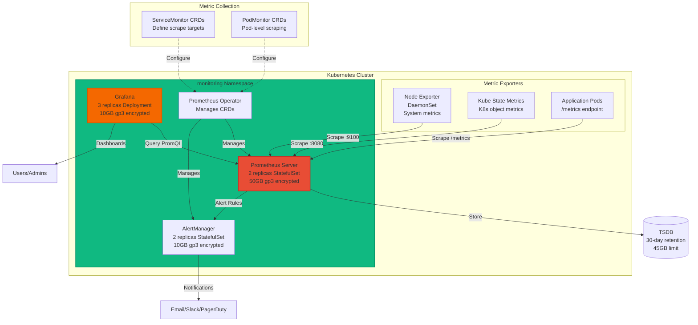

#### Prometheus Stack Components

**1. Prometheus Server**
- **Replicas:** 2 (HA configuration)
- **Storage:** 50GB gp3 encrypted with KMS
- **Retention:** 30 days or 45GB (whichever comes first)
- **Resources:**
  - Requests: 500m CPU, 2Gi memory
  - Limits: 2000m CPU, 4Gi memory

**2. Grafana**
- **Replicas:** 3 (web tier HA)
- **Storage:** 10GB gp3 encrypted
- **Default Datasource:** Prometheus (auto-configured)
- **Dashboards:** Pre-loaded Kubernetes monitoring dashboards
- **Resources:**
  - Requests: 100m CPU, 128Mi memory
  - Limits: 500m CPU, 512Mi memory

**3. AlertManager**
- **Replicas:** 2 (alert HA)
- **Storage:** 10GB gp3 encrypted
- **Purpose:** Alert routing, deduplication, silencing

**4. Kube State Metrics**
- Exposes cluster-level metrics
- Deployment counts, pod states, resource quotas

**5. Node Exporter** (DaemonSet)
- Runs on every node
- Exposes node-level metrics (CPU, memory, disk, network)

**6. Prometheus Operator**
- Manages Prometheus, AlertManager via CRDs
- Handles ServiceMonitor, PodMonitor, PrometheusRule

#### Key Metrics Collected

```yaml
# Node Metrics (via Node Exporter)
node_cpu_seconds_total
node_memory_MemTotal_bytes
node_filesystem_avail_bytes
node_network_receive_bytes_total

# Kubernetes Metrics (via Kube State Metrics)
kube_deployment_status_replicas_available
kube_pod_container_status_restarts_total
kube_node_status_condition
kube_persistentvolumeclaim_status_phase

# Container Metrics (via cAdvisor)
container_cpu_usage_seconds_total
container_memory_working_set_bytes
container_network_receive_bytes_total

# Custom App Metrics (via /metrics)
http_requests_total
http_request_duration_seconds
app_errors_total
```

#### Sample Grafana Dashboards

1. **Kubernetes Cluster Monitoring**
   - Cluster resource usage
   - Node capacity and utilization
   - Pod distribution across nodes

2. **Kubernetes Pods**
   - CPU and memory usage per pod
   - Network I/O
   - Restart count

3. **Kubernetes StatefulSets**
   - StatefulSet status
   - Persistent volume usage

4. **Node Exporter**
   - System load
   - Filesystem usage
   - Network statistics

---

## Sample Applications

### Application Portfolio

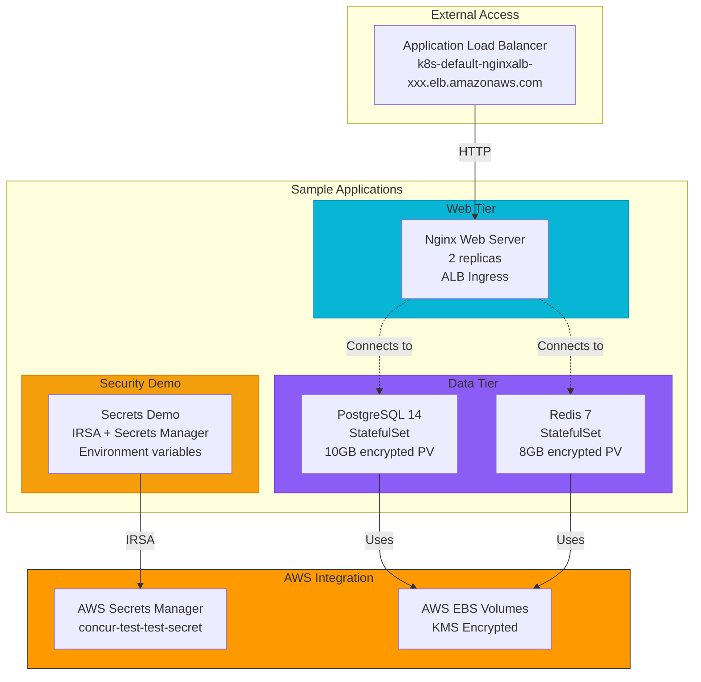

### 1. Nginx with ALB Ingress

**Purpose:** Demonstrates AWS Load Balancer Controller integration

```yaml
apiVersion: networking.k8s.io/v1
kind: Ingress
metadata:
  name: nginx
  annotations:
    alb.ingress.kubernetes.io/scheme: internet-facing
    alb.ingress.kubernetes.io/target-type: ip
    alb.ingress.kubernetes.io/healthcheck-path: /
spec:
  ingressClassName: alb
  rules:
    - http:
        paths:
          - path: /
            pathType: Prefix
            backend:
              service:
                name: nginx
                port:
                  number: 80
```

**Access:**
```bash
# Get ALB URL
kubectl get ingress nginx -o jsonpath='{.status.loadBalancer.ingress[0].hostname}'

# Test
curl http://k8s-default-nginxalb-xxx.elb.us-east-1.amazonaws.com
```

### 2. PostgreSQL StatefulSet

**Purpose:** Demonstrates stateful application with persistent storage

**Features:**
- Encrypted gp3 PersistentVolume (10GB)
- StatefulSet for stable network identity
- Headless service for direct pod access

**Connection:**
```bash
# Port-forward to local
kubectl port-forward svc/postgres 5432:5432

# Connect with psql
psql -h localhost -U postgres -d testdb
```

### 3. Redis StatefulSet

**Purpose:** Demonstrates in-memory data store with persistence

**Features:**
- Encrypted gp3 PersistentVolume (8GB)
- AOF persistence enabled
- Resource limits configured

**Connection:**
```bash
# Port-forward
kubectl port-forward svc/redis 6379:6379

# Connect with redis-cli
redis-cli -h localhost
> PING
PONG
```

### 4. Secrets Manager Demo

**Purpose:** Demonstrates IRSA + AWS Secrets Manager integration

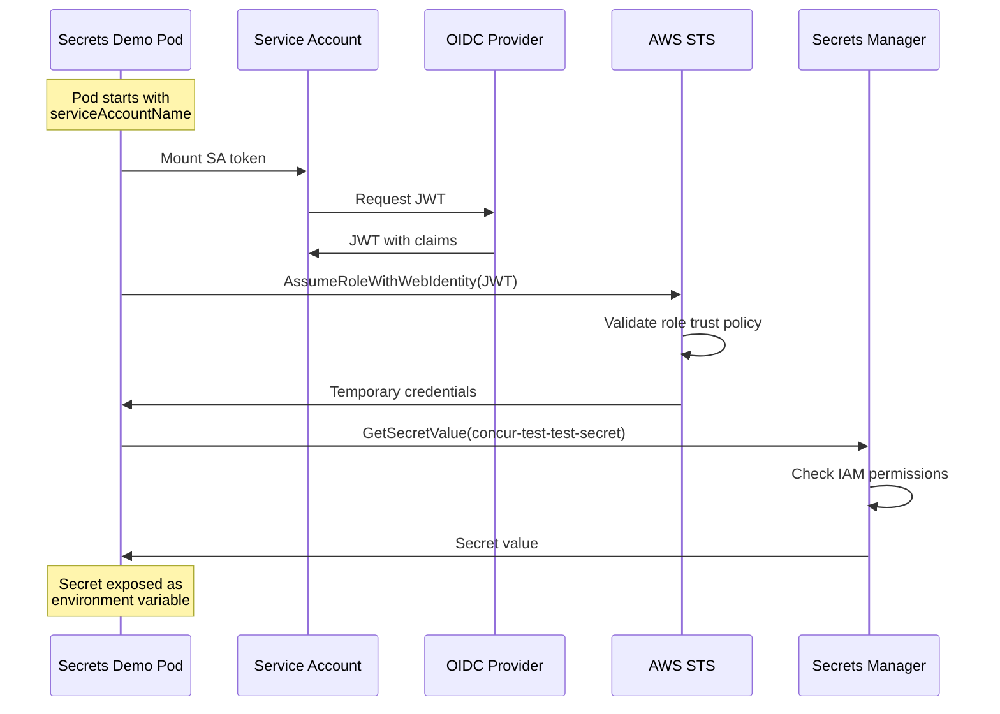

**Manifest Highlights:**
```yaml
apiVersion: v1
kind: ServiceAccount
metadata:
  name: secrets-reader
  annotations:
    eks.amazonaws.com/role-arn: "arn:aws:iam::ACCOUNT:role/test-app-secrets-reader-role"
---
apiVersion: v1
kind: Pod
spec:
  serviceAccountName: secrets-reader
  containers:
    - name: app
      env:
        - name: DB_PASSWORD
          valueFrom:
            secretKeyRef:
              name: db-credentials  # Populated by external-secrets-operator
              key: password
```

---

## Access Guide

### Prerequisites

```bash
# Install required tools
brew install kubectl argocd helm awscli

# Configure AWS credentials
aws configure
# Use your IAM user credentials

# Configure kubectl
aws eks update-kubeconfig --region us-east-1 --name concur-test-eks
```

### ArgoCD Access

**URL:** `http://k8s-argocd-argocdse-50d2545e50-d7cfc09ea0ab6fef.elb.us-east-1.amazonaws.com`

**Credentials:**
```bash
# Username: admin

# Password: Get from secret
kubectl -n argocd get secret argocd-initial-admin-secret \
  -o jsonpath="{.data.password}" | base64 -d
```

**CLI Login:**
```bash
# Get ArgoCD URL
ARGOCD_URL=$(kubectl get svc -n argocd argocd-server \
  -o jsonpath='{.status.loadBalancer.ingress[0].hostname}')

# Login
argocd login $ARGOCD_URL --username admin --insecure

# List apps
argocd app list

# Get app details
argocd app get nginx-alb

# Sync app
argocd app sync nginx-alb

# View logs
argocd app logs nginx-alb
```

### Prometheus Access

**URL:** Port-forward required (no LoadBalancer)

```bash
# Port-forward Prometheus
kubectl port-forward -n monitoring svc/prometheus-stack-kube-prom-prometheus 9090:9090

# Access at: http://localhost:9090
```

**Sample PromQL Queries:**
```promql
# CPU usage by pod
sum(rate(container_cpu_usage_seconds_total{pod!=""}[5m])) by (pod)

# Memory usage by namespace
sum(container_memory_working_set_bytes{namespace!=""}) by (namespace)

# Pod restart count
kube_pod_container_status_restarts_total

# Node CPU usage
100 - (avg by (instance) (irate(node_cpu_seconds_total{mode="idle"}[5m])) * 100)
```

### Grafana Access

**URL:** Port-forward required

```bash
# Port-forward Grafana
kubectl port-forward -n monitoring svc/prometheus-stack-grafana 3000:80

# Access at: http://localhost:3000
```

**Credentials:**
```
Username: admin
Password: admin
(Change on first login)
```

**Navigate to:**
- `Dashboards` → `Kubernetes / Compute Resources / Cluster`
- `Dashboards` → `Kubernetes / Compute Resources / Namespace (Pods)`
- `Dashboards` → `Node Exporter / Nodes`

### Linkerd Viz Dashboard Access

**URL:** Port-forward required

```bash
# Port-forward Linkerd Viz
kubectl port-forward -n linkerd-viz svc/web 8084:8084

# Access at: http://localhost:8084
```

**Features:**
- **Live Traffic:** Real-time request/response inspection
- **Golden Metrics:** Success rate, RPS, latency percentiles
- **Service Topology:** Visualize dependencies and traffic flow
- **Top Routes:** Identify slow/high-traffic endpoints
- **Tap:** Debug production issues without redeploying

**Sample Commands:**
```bash
# Check mesh status
linkerd check

# View meshed deployments
linkerd viz stat deploy --all-namespaces

# Tap live traffic (look for tls=true for meshed traffic)
linkerd viz tap deploy/nginx -n nginx-alb

# View route metrics
linkerd viz routes deploy/nginx -n nginx-alb
```

**Documentation:** See `LINKERD-DEPLOYMENT.md` for complete guide with 7 demo scenarios.

### CloudWatch Logs Access

**AWS Console:**
1. Navigate to CloudWatch → Log groups
2. Select `/aws/eks/concur-test-eks/all-pods`
3. Filter by log stream: `default/nginx-*`, `monitoring/prometheus-*`

**AWS CLI:**
```bash
# Tail all logs
aws logs tail /aws/eks/concur-test-eks/all-pods --follow --region us-east-1

# Filter by namespace
aws logs tail /aws/eks/concur-test-eks/all-pods \
  --follow \
  --filter-pattern "default" \
  --region us-east-1

# Query logs (CloudWatch Insights)
aws logs start-query \
  --log-group-name /aws/eks/concur-test-eks/all-pods \
  --start-time $(date -u -d '1 hour ago' +%s) \
  --end-time $(date -u +%s) \
  --query-string 'fields @timestamp, k8s_namespace_name, k8s_pod_name, log | filter k8s_namespace_name = "default"' \
  --region us-east-1
```

---

## Demo Scenarios

### Scenario 1: GitOps Deployment Flow

**Objective:** Demonstrate automated deployment via ArgoCD

```bash
# 1. Clone the repository
git clone https://github.com/softwareengineerva/eks.git
cd eks

# 2. Modify nginx replicas
vim k8s-manifests/nginx-alb/deployment.yaml
# Change: replicas: 2 -> replicas: 3

# 3. Commit and push
git add k8s-manifests/nginx-alb/deployment.yaml
git commit -m "Scale nginx to 3 replicas for demo"
git push origin main

# 4. Watch ArgoCD sync (within 3 minutes)
watch -n 2 'argocd app get nginx-alb | grep "Sync Status"'

# 5. Verify pods
kubectl get pods -l app=nginx
# Should show 3 pods

# 6. View in ArgoCD UI
# Navigate to nginx-alb app
# See sync activity in Timeline
```

**Expected Outcome:**
- ArgoCD detects Git change
- Status changes: Synced → OutOfSync → Syncing → Synced
- New pod created automatically
- Health status: Healthy

### Scenario 2: Self-Healing Demonstration

**Objective:** Show ArgoCD auto-remediation

```bash
# 1. Manually delete a pod
kubectl delete pod -l app=nginx --force --grace-period=0

# 2. ArgoCD detects missing pod
# Self-heal triggers immediately (no 3-min wait)

# 3. Watch recovery
kubectl get pods -l app=nginx -w
# New pod created automatically

# 4. Check ArgoCD
argocd app get nginx-alb
# Should show: Synced, Healthy
```

### Scenario 3: Auto-Scaling in Action

**Objective:** Demonstrate Cluster Autoscaler

```bash
# 1. Check current node count
kubectl get nodes
# Currently: 4 nodes

# 2. Create resource-intensive deployment
kubectl create deployment stress-test --image=polinux/stress \
  --replicas=10 -- stress --cpu 2 --timeout 600s

# 3. Request significant resources
kubectl set resources deployment stress-test \
  --requests=cpu=1000m,memory=1Gi \
  --limits=cpu=2000m,memory=2Gi

# 4. Watch pods go pending
kubectl get pods -l app=stress-test
# Many pods: Pending (Insufficient cpu/memory)

# 5. Watch Cluster Autoscaler logs
kubectl logs -n kube-system deployment/cluster-autoscaler --follow

# 6. Observe node scale-up
watch kubectl get nodes
# Should scale from 4 -> 5 or 6 nodes

# 7. Cleanup
kubectl delete deployment stress-test

# 8. Watch scale-down (after ~10 minutes)
# Cluster Autoscaler removes underutilized nodes
```

### Scenario 4: Logging Pipeline

**Objective:** Show end-to-end logging

```bash
# 1. Generate log traffic
kubectl run log-generator --image=busybox --restart=Never \
  -- sh -c 'for i in $(seq 1 100); do echo "Log entry $i at $(date)"; sleep 1; done'

# 2. Watch Fluent Bit processing
kubectl logs -n logging daemonset/fluent-bit --tail=20 --follow

# 3. Check CloudWatch (wait 30 seconds for batch upload)
aws logs tail /aws/eks/concur-test-eks/all-pods \
  --follow \
  --filter-pattern "log-generator" \
  --region us-east-1

# 4. Verify structured logs
# Should see JSON with k8s_namespace_name, k8s_pod_name, etc.

# 5. Cleanup
kubectl delete pod log-generator
```

### Scenario 5: Secrets Management

**Objective:** Demonstrate IRSA + Secrets Manager

```bash
# 1. Create a secret in AWS Secrets Manager
aws secretsmanager create-secret \
  --name concur-demo-db-password \
  --secret-string '{"password":"P@ssw0rd123!"}' \
  --region us-east-1

# 2. Update IAM policy to allow access
# (Already configured in Terraform)

# 3. Deploy pod with IRSA
kubectl apply -f k8s-manifests/secrets-demo/deployment.yaml

# 4. Verify pod has secret
kubectl exec -it deployment/secrets-demo -- env | grep DB_PASSWORD

# 5. Check pod logs
kubectl logs deployment/secrets-demo
# Should show successful secret retrieval

# 6. Cleanup
aws secretsmanager delete-secret \
  --secret-id concur-demo-db-password \
  --force-delete-without-recovery \
  --region us-east-1
```

### Scenario 6: Service Mesh mTLS Verification

**Objective:** Demonstrate automatic mutual TLS encryption between services

```bash
# 1. Check Linkerd health and certificate status
linkerd check

# Expected output:
# ✓ certificate config is valid
# ✓ all proxy certificates have valid trust anchors
# ✓ trust anchors are within their validity period

# 2. View meshed services
linkerd viz stat deploy --all-namespaces

# Expected output shows MESHED column:
# NAMESPACE    NAME             MESHED   SUCCESS   RPS   LATENCY_P50
# nginx-alb    nginx            3/3      100.00%   2.5   5ms
# postgres     postgres         1/1      100.00%   0.1   3ms
# redis        redis            1/1      100.00%   0.2   2ms

# 3. Create a test pod that generates meshed traffic
cat <<EOF | kubectl apply -f -
apiVersion: v1
kind: Pod
metadata:
  name: curl-test
  namespace: nginx-alb
spec:
  containers:
  - name: curl
    image: curlimages/curl
    command: ["sh", "-c", "while true; do curl -s http://nginx.nginx-alb.svc.cluster.local/ > /dev/null; sleep 2; done"]
EOF

# 4. Wait for pod to be meshed
sleep 5
kubectl get pod curl-test -n nginx-alb -o jsonpath='{.spec.containers[*].name}'
# Should output: linkerd-proxy curl (shows sidecar injection)

# 5. Tap live traffic to see mTLS encryption
linkerd viz tap deploy/nginx -n nginx-alb --to svc/nginx

# Expected output - look for tls=true:
# req id=5:3 proxy=in  src=10.0.1.15:54622 dst=10.0.2.59:80 tls=true :method=GET
# rsp id=5:3 proxy=in  src=10.0.1.15:54622 dst=10.0.2.59:80 tls=true :status=200 latency=391µs

# 6. View service topology in dashboard
kubectl port-forward -n linkerd-viz svc/web 8084:8084 &
# Open http://localhost:8084
# Navigate to nginx-alb namespace to see live traffic graph

# 7. Check golden metrics
linkerd viz routes deploy/nginx -n nginx-alb

# Shows per-route metrics:
# ROUTE    SERVICE   SUCCESS   RPS   LATENCY_P50   LATENCY_P95   LATENCY_P99
# GET /    nginx     100.00%   1.0   2ms          5ms          10ms

# 8. Cleanup
kubectl delete pod curl-test -n nginx-alb
```

**What This Demonstrates:**
- ✅ **Zero-trust security:** All pod-to-pod traffic encrypted with mTLS
- ✅ **Certificate-based identity:** Each pod has unique certificate
- ✅ **No code changes:** Automatic sidecar injection via namespace annotation
- ✅ **Sub-millisecond overhead:** Minimal latency impact (<1ms p50)
- ✅ **Advanced observability:** Success rate, RPS, latency without instrumentation

**Documentation:** See `LINKERD-DEPLOYMENT.md` for 6 additional demo scenarios including traffic splitting, circuit breaking, and authorization policies.

---

## Technical Deep Dive

### Security Best Practices

1. **Network Isolation**
   - EKS control plane in private subnets
   - Worker nodes in private subnets (no public IPs)
   - NAT Gateways for outbound internet (e.g., pull images)
   - Security groups with least privilege

2. **Encryption at Rest**
   - All EBS volumes encrypted with KMS
   - Key: `concur-test-ebs-kms-key`
   - Automatic key rotation enabled

3. **Encryption in Transit**
   - TLS for all AWS API calls
   - HTTPS for ArgoCD, Grafana
   - TLS for Prometheus scraping (optional, not enabled)
   - **Linkerd mTLS:** Automatic encryption for all pod-to-pod traffic
     - Certificate-based identity for every pod
     - 24-hour certificate rotation
     - Zero-trust security model

4. **IAM & RBAC**
   - IRSA for fine-grained pod permissions
   - No long-lived credentials in pods
   - Kubernetes RBAC for ArgoCD service accounts

5. **Secrets Management**
   - AWS Secrets Manager for sensitive data
   - No secrets in Git or container images
   - IRSA-based access (no API keys)

6. **Audit Logging**
   - All EKS control plane logs enabled
   - CloudWatch log retention: 7 days
   - Fluent Bit captures all container logs

### Cost Optimization

**Current Monthly Costs (Estimated):**

| Component | Cost | Notes |
|-----------|------|-------|
| EKS Control Plane | $73 | $0.10/hour |
| EC2 t3.medium × 4 | $120 | ~$30/instance |
| NAT Gateways × 3 | $96 | $32/NAT + data transfer |
| EBS Volumes | $15 | ~100GB gp3 total |
| ALB | $20 | ~$16/month + data |
| CloudWatch Logs | $5 | ~1GB ingested/month |
| **Total** | **~$329/month** | Excluding data transfer |

**Cost Optimization Strategies:**

1. **Reduce NAT Gateways:** Use 1 instead of 3 (saves $64/month)
   ```hcl
   single_nat_gateway = true  # In terraform.tfvars
   ```

2. **Use Spot Instances:** 60-80% savings on compute
   ```hcl
   capacity_type = "SPOT"  # In node group config
   ```

3. **Right-Size Nodes:** Consider t3.small or t3a.medium
4. **Implement Autoscaling Schedules:** Scale down during off-hours
5. **Use Fargate for Burst Workloads:** No idle node costs

### Disaster Recovery

**Backup Strategy:**

1. **Git as Source of Truth**
   - All manifests in GitHub
   - Can recreate entire stack from Git

2. **Terraform State**
   - Store in S3 with versioning
   - Enable state locking with DynamoDB

3. **Persistent Data**
   - Use AWS Backup for EBS snapshots
   - Database exports to S3

**Recovery Scenarios:**

| Scenario | Recovery Procedure | RTO | RPO |
|----------|-------------------|-----|-----|
| Pod failure | Kubernetes auto-restarts | < 1 min | 0 |
| Node failure | Cluster Autoscaler replaces | < 5 min | 0 |
| AZ failure | Pods reschedule to other AZs | < 10 min | 0 |
| Region failure | Deploy to new region from Git | < 2 hours | Last commit |
| Complete cluster loss | `terraform apply` + ArgoCD sync | < 3 hours | Last commit |

**Recovery Steps:**

```bash
# 1. Recreate infrastructure
cd terraform
terraform init
terraform apply

# 2. Deploy ArgoCD
kubectl apply -k argocd/base

# 3. Deploy apps
kubectl apply -f argocd-apps/

# 4. ArgoCD auto-syncs all applications
# Wait 5-10 minutes for full reconciliation

# 5. Restore persistent data (if needed)
# - Restore EBS snapshots
# - Import database dumps
```

### Troubleshooting Guide

**Common Issues:**

1. **Pods Stuck in Pending**
   ```bash
   # Check pod events
   kubectl describe pod <pod-name>

   # Common causes:
   # - Insufficient resources: Scale nodes
   # - PVC not bound: Check storage class
   # - Image pull error: Check ECR permissions
   ```

2. **ArgoCD App OutOfSync**
   ```bash
   # View diff
   argocd app diff <app-name>

   # Force sync
   argocd app sync <app-name> --force

   # Check app logs
   argocd app logs <app-name>
   ```

3. **Fluent Bit Not Sending Logs**
   ```bash
   # Check Fluent Bit logs
   kubectl logs -n logging daemonset/fluent-bit

   # Verify IRSA role
   kubectl describe sa -n logging fluent-bit

   # Test CloudWatch API access
   kubectl exec -n logging daemonset/fluent-bit -- \
     aws logs describe-log-groups --region us-east-1
   ```

4. **Cluster Autoscaler Not Scaling**
   ```bash
   # Check autoscaler logs
   kubectl logs -n kube-system deployment/cluster-autoscaler

   # Verify IAM permissions
   kubectl describe sa -n kube-system cluster-autoscaler

   # Check node group tags
   aws eks describe-nodegroup \
     --cluster-name concur-test-eks \
     --nodegroup-name concur-test-eks-node-group
   ```

---

## Appendix

### Repository Structure

```
eks/
├── README.md                          # Main documentation
├── terraform/                         # Infrastructure as Code
│   ├── provider.tf
│   ├── versions.tf
│   ├── variables.tf
│   ├── terraform.tfvars
│   ├── terraform.tfvars.example
│   ├── locals.tf
│   ├── vpc.tf                         # VPC, subnets, NAT, IGW
│   ├── security-groups.tf             # Security groups
│   ├── iam.tf                         # IAM roles (cluster, nodes, OIDC)
│   ├── eks.tf                         # EKS cluster, node group, addons
│   ├── ebs-csi.tf                     # EBS CSI driver + IRSA
│   ├── alb-controller.tf              # AWS LB Controller + IRSA
│   ├── cluster-autoscaler.tf          # Cluster Autoscaler IRSA
│   ├── postgres-secrets.tf            # PostgreSQL secrets + IRSA
│   ├── test-app-irsa.tf               # Test app IRSA role
│   ├── secrets-store-csi.tf           # Secrets Store CSI driver
│   ├── argocd.tf                      # ArgoCD installation
│   ├── fluent-bit.tf                  # Fluent Bit Pod Identity
│   ├── outputs.tf
│   └── README.md                      # Terraform documentation
│
├── argocd-apps/                       # ArgoCD Application CRDs
│   ├── cluster-autoscaler-app.yaml
│   ├── fluent-bit-app.yaml
│   ├── monitoring-app.yaml            # Prometheus stack
│   ├── nginx-alb-app-enhanced.yaml    # NGINX with notifications
│   ├── postgres-app.yaml
│   ├── redis-app.yaml
│   ├── secrets-demo-app.yaml
│   └── smtp-relay-app.yaml
│
├── argocd-config/                     # ArgoCD notifications config
│   ├── README.md                      # Notification setup guide
│   ├── QUICK-REFERENCE.md             # Quick commands
│   ├── SETUP-EMAIL-TO-SLACK.md        # Email-to-Slack setup
│   ├── SETUP-SMTP-RELAY.md            # SMTP relay setup
│   ├── argocd-notifications-cm.yaml   # Notification templates
│   ├── argocd-notifications-secret.yaml  # SMTP credentials
│   ├── deploy-all.sh                  # Deploy all apps script
│   └── setup-notifications.sh         # Notification setup script
│
├── k8s-manifests/                     # Kubernetes manifests
│   ├── cluster-autoscaler/
│   │   ├── serviceaccount.yaml
│   │   ├── clusterrole.yaml
│   │   ├── clusterrolebinding.yaml
│   │   └── deployment.yaml
│   │
│   ├── fluent-bit/
│   │   ├── namespace.yaml
│   │   ├── serviceaccount.yaml
│   │   ├── clusterrole.yaml
│   │   ├── clusterrolebinding.yaml
│   │   ├── configmap.yaml             # Fluent Bit config
│   │   └── daemonset.yaml
│   │
│   ├── linkerd/
│   │   ├── helm-values.yaml           # Linkerd control plane values
│   │   └── tap-rbac.yaml              # Linkerd tap RBAC
│   │
│   ├── monitoring/
│   │   ├── namespace.yaml
│   │   └── helm-values.yaml           # kube-prometheus-stack values
│   │
│   ├── nginx-alb/
│   │   ├── base/                      # Kustomize base
│   │   └── overlays/dev/              # Dev environment overlay
│   │
│   ├── postgres/
│   │   ├── configmap.yaml
│   │   ├── service.yaml
│   │   └── statefulset.yaml
│   │
│   ├── redis/
│   │   ├── configmap.yaml
│   │   ├── service.yaml
│   │   └── statefulset.yaml
│   │
│   ├── secrets-demo/
│   │   ├── serviceaccount.yaml
│   │   ├── secret.yaml
│   │   └── deployment.yaml
│   │
│   └── smtp-relay/
│       ├── configmap.yaml
│       ├── service.yaml
│       └── deployment.yaml
│
├── grafana-dashboards/                # Custom Grafana dashboards
│   ├── README.md
│   ├── k8s-apiserver-dashboard.json
│   ├── nginx-simple-dashboard.json
│   ├── nginx-load-test-dashboard.json
│   └── postgres-load-test-dashboard.json
│
├── scripts/                           # Utility scripts
│   ├── README.md
│   ├── nginx-load-test.sh             # NGINX load testing
│   └── postgres-load-test.sh          # PostgreSQL load testing
│
├── .github/workflows/                 # GitHub Actions
│   ├── terraform-deploy.yml           # Terraform deployment
│   └── argocd-deploy.yml              # ArgoCD deployment
│
└── .gitlab-ci.yml                     # GitLab CI/CD pipeline
```

### Key Metrics Summary

**Cluster Health:**
- ✅ Control Plane: Healthy
- ✅ Nodes: 4/4 Ready
- ✅ System Pods: All running
- ✅ DNS: CoreDNS 2/2
- ✅ Network: VPC CNI healthy

**ArgoCD Status:**
- ✅ Applications: 10 total
- ✅ Synced: 10/10
- ✅ Healthy: 10/10

**Service Mesh (Linkerd):**
- ✅ Control Plane: 6 pods running (HA 2 replicas)
- ✅ Viz Dashboard: 4 pods running
- ✅ Meshed Pods: nginx-alb (3/3), postgres (1/1), redis (1/1), secrets-demo (1/1)
- ✅ mTLS: Automatic encryption enabled
- ✅ Certificates: Valid, auto-rotating every 24h

**Observability:**
- ✅ Fluent Bit: 3/4 DaemonSet (node-dependent)
- ✅ CloudWatch: Receiving logs
- ✅ Prometheus: 2/2 replicas, scraping targets + Linkerd metrics
- ✅ Grafana: 3/3 replicas, dashboards loaded
- ✅ AlertManager: 2/2 replicas
- ✅ Linkerd Viz: Live traffic tap, golden metrics

**Storage:**
- ✅ Storage Class: gp3 (default, encrypted)
- ✅ PVCs: All Bound
- ✅ Volumes: All encrypted with KMS

**Security:**
- ✅ IRSA: 6 roles configured
- ✅ Secrets: AWS Secrets Manager integrated
- ✅ Network: Private subnets, security groups
- ✅ Audit: All logs enabled
- ✅ mTLS: All pod-to-pod traffic encrypted (Linkerd)

---

## Q&A

### 1. **Why EKS over Self-Managed Kubernetes?**
- **Managed Control Plane:** AWS handles upgrades, patching, HA
- **AWS Integration:** Native VPC, IAM, ELB, EBS
- **Reliability:** 99.95% SLA for control plane
- **Cost:** Only pay for worker nodes (control plane $73/month)

### 2. **GitOps Benefits (ArgoCD)**
- **Single Source of Truth:** Git is declarative state
- **Audit Trail:** All changes tracked in Git history
- **Rollback:** `git revert` to previous state
- **Self-Healing:** Automatic drift correction
- **Multi-Cluster:** One ArgoCD can manage multiple clusters

### 3. **Observability Strategy**
- **Logging:** Fluent Bit → CloudWatch (centralized, searchable)
- **Metrics:** Prometheus (TSDB for time-series)
- **Visualization:** Grafana (pre-built K8s dashboards)
- **Alerting:** AlertManager (PagerDuty, Slack integration)

### 4. **Security Posture**
- **Zero Trust:** IRSA (no long-lived credentials)
- **Encryption:** At-rest (KMS), in-transit (TLS)
- **Network Segmentation:** Private subnets, security groups
- **Least Privilege:** Fine-grained IAM policies
- **Secrets:** External (Secrets Manager), not in code

### 5. **Scalability & Resilience**
- **Multi-AZ:** 3 AZs for node distribution
- **Auto-Scaling:** Cluster Autoscaler (nodes), HPA (pods)
- **Load Balancing:** ALB for traffic distribution
- **Stateful Apps:** StatefulSets with PVs
- **Self-Healing:** Kubernetes + ArgoCD

### 6. **Cost Management**
- **Right-Sizing:** Monitor with Prometheus, adjust resources
- **Spot Instances:** 60-80% savings (for fault-tolerant workloads)
- **NAT Optimization:** Single NAT for dev (not HA)
- **Storage:** gp3 (20% cheaper than gp2)
- **Autoscaling:** Scale down during off-hours

### 7. **Production Readiness Checklist**
- ✅ Multi-AZ deployment
- ✅ IRSA (no static credentials)
- ✅ Encrypted storage (KMS)
- ✅ **Service Mesh (Linkerd)** - mTLS for zero-trust security
- ✅ Logging (CloudWatch)
- ✅ Monitoring (Prometheus + Grafana + Linkerd Viz)
- ✅ GitOps (ArgoCD)
- ✅ Auto-scaling (Cluster Autoscaler)
- ✅ Ingress (ALB Controller)
- ⚠️ **TODO for Production:**
  - [ ] Implement backup strategy (Velero)
  - [ ] Configure AlertManager notifications
  - [ ] Set up WAF on ALB
  - [ ] Implement Linkerd authorization policies (network policies alternative)
  - [ ] Add Grafana LDAP/SSO
  - [ ] Remote Terraform state (S3 + DynamoDB)
  - [ ] Configure Linkerd traffic splitting for canary deployments

---

## Conclusion

This POC demonstrates a **production-ready EKS platform** with:
- ✅ Infrastructure as Code (Terraform)
- ✅ GitOps (ArgoCD)
- ✅ **Service Mesh (Linkerd)** - Zero-trust mTLS and advanced observability
- ✅ Comprehensive Observability (Logging + Metrics + Live Traffic Tap)
- ✅ Security (IRSA, encryption, Secrets Manager, automatic mTLS)
- ✅ Auto-Scaling (Cluster Autoscaler)
- ✅ Sample Applications (web, databases, secrets demo)

The platform is **scalable**, **secure**, and **cost-effective**, following AWS Well-Architected Framework principles with production-grade service mesh capabilities.

---